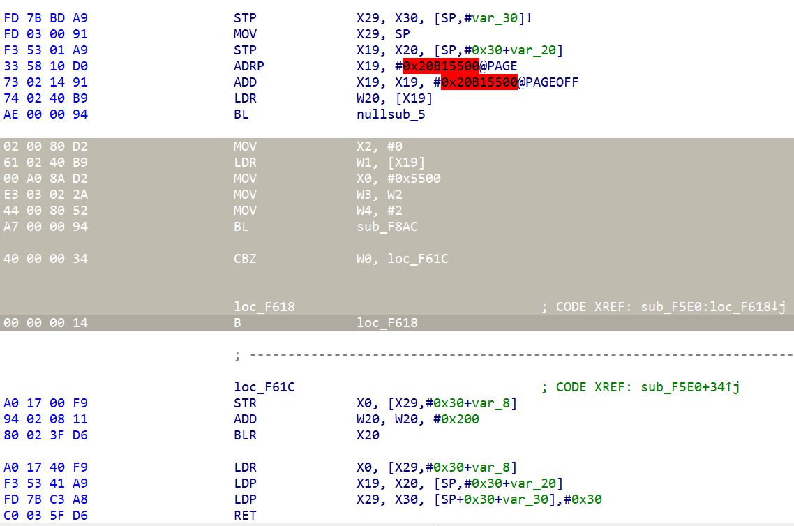
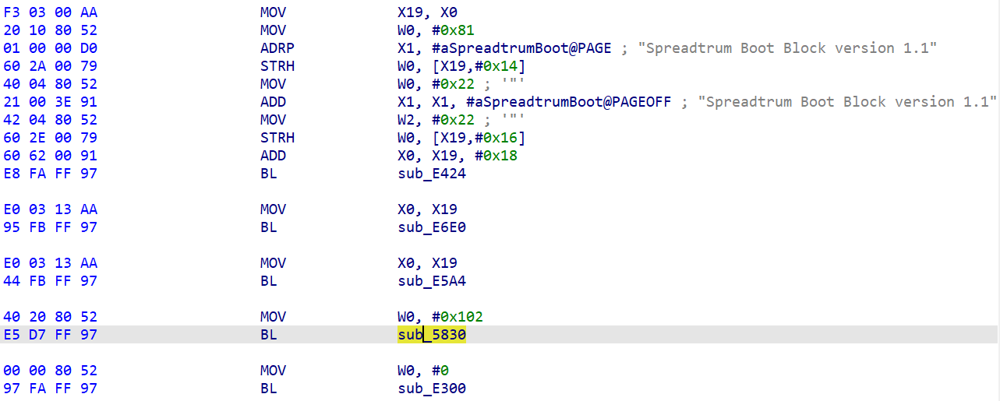

# CVE-2022-38694

An attacker with physical access to the device can overwrite a function pointer somewhere in the BootROM data section or a return address stored on the stack and execute their own code with BootROM privileges.

For detailed information, read [the article by NCC Group](https://research.nccgroup.com/2022/09/02/theres-another-hole-in-your-soc-unisoc-rom-vulnerabilities/).

## Use CVE-2022-38694 to unlock bootloader

### Part 1: overwrite stack to execute FDL1 without verfication

For Unisoc T7510 (T740) Soc, check [BootROM](https://github.com/TomKing062/T7510_bootrom) or [stack-info.csv](https://github.com/TomKing062/CVE-2022-38694_unlock_bootloader/blob/info/stack-info.csv).

If the device entered download mode by holding a specific button (typically volume down) during power up, overwrite stack using custom_exec_no_verify_3f88.bin.

If the device entered download mode when all boot attempts failed (eg. splloader is wiped and no key is pressed), overwrite stack using custom_exec_no_verify_3f28.bin.

For other Socs affected by CVE-2022-38694, make custom_exec.bin accroding to BootROM.

### Part 2: modify FDL1

#### Patch 1: NOP(1F 20 03 D5) verfication in `data_exec`.

#### Patch 2: change download mode (0x102)(40 20 80 52) to boot mode(0x104)(80 20 80 52).

Apply patch 1 to original FDL1, save as fdl1-dl.bin.

Apply patch 1 and patch 2 to original FDL1, save as fdl1-boot.bin.

##### It seems safe to use FDL1 of another model (same Soc).

### Part 3: modify FDL2(uboot)

#### Patch 1: patch `do_cboot`.

search for `VerifiedBoot-UNLOCK` to find `set_lock_status`.

search for `0x32121BAC` or `0x1BAC` (T7510 specific address ?), and `reboot_devices` starts with `CMP W0,#3 ` `CMP W0,#4` `CMP W0,#2`.

search for `enter boot mode` to find `do_cboot`, patch it to call `set_lock_status` and `reboot_devices`.

#### Patch 2 : NOP write check of secure partitions.

Patch 2 is used in previous version, now it's optional since we don't `write_part`.

##### The uboot for unlocking bootloader (boot mode) must be device-specific. However, you can use another model (same Soc) uboot in download mode to `read_part` your device uboot.

### Part 4: get trustos images list and load address from splloader

get splloader by `read_part`

The list and address are easy to get, since `_start` calls `reset`, `reset` call `nand_boot`, `nand_boot` will load images from emmc/ufs to memory and boot.

| device               | sml        | teecfg     | tos        |
| -------------------- | ---------- | ---------- | ---------- |
| tyyh2020 (android9)  | 0x94000000 | no need    | 0x94040000 |
| tyyh2021 (android10) | 0x94000000 | 0x94020000 | 0x94040000 |

#### Misc: you need to know correct partition size to `read_part`, this can be done by `read partition` in ResearchDownload or `read_part user_partition 0 17K efi_part.bin`.
